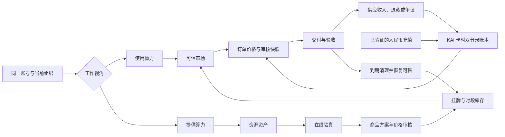

# KAI Cloud 手机版与交易平台总体实施方案 V2.0

状态：主方案定稿，后续产品、后端、移动端、运营后台和上架工作统一以本文为执行基线。  
依据：《KAI Cloud 统一卡时交易与全品类算力资源闭环白皮书 V1.0》、现有独立移动端与后端、资源上架审核方案及双视角布局方案。  
工作方式：按阶段、小批次实施；每一小段完成代码、测试、迁移与验收后再继续，不一次性大改。

## 1. 产品定位与成功标准

KAI Cloud 不是网页版交易市场的手机壳，也不是单纯的充值工具。它是同时服务“使用算力”和“提供算力”的移动算力工作台：

- 使用方能理解资源、可信地购买、顺利交付并清楚处理退款；
- 提供方能用最少步骤完成主体开通、资源验真、价格审核、上架、交付和结算；
- 平台能逐笔证明资源、价格、卡时、订单、交付和资金流向。

正式上线的成功标准不是“页面能打开”，而是以下闭环全部成立：

1. 同一账号无需退出即可切换两种工作视角；
2. 真实供应方能够完成一项 H100 资源的首次上架；
3. 真实使用方能够用卡时购买 `1 张 × 1 小时`，完成交付、验收和清理；
4. 一笔完整退款和一次争议路径可追溯；
5. 支付、卡时账本、订单、供应方收入和对账始终平衡；
6. 未认证、未验真、未定价、审核过期或暂停资源无法发布和下单；
7. Android 正式包、生产 API、隐私/账户删除、商店声明和支付政策路径全部通过门禁。

## 2. 统一产品结构：一个账号，两个工作视角

界面不使用“买家/卖家”，采用用户容易理解的：

`使用算力 / 提供算力`

这是同一账号下的两个工作环境，不是两个账号、两套实名或两个卡时账户。账号、当前组织、身份认证、安全设置和账本共用；首页、底部导航、默认消息和主要操作随视角变化。

### 2.1 视角切换

一级页面顶部固定放一键切换器。新用户默认“使用算力”，设备记住最近视角：

```text
┌────────────────────────────────┐
│ KAI Cloud              通知/头像 │
│   [ 使用算力 ] [ 提供算力 2 ]    │
└────────────────────────────────┘
```

- 点击立即切换，不重新登录、不弹确认框；
- 草稿先自动保存，切换不丢数据；
- 结账、支付确认、审核表单等关键深层流程隐藏切换器，避免误触；
- 切换只改变界面上下文，服务端权限不随客户端开关提升；
- 未开通供应资格也可预览提供侧，但只能执行“开始认证”，不能伪装已具备上架资格。

### 2.2 使用算力视角

底部导航：

`首页 / 市场 / 订单 / 消息 / 我的`

- **首页**：卡时余额、待办订单、常用资源、最近账本；
- **市场**：仅展示已完成双审核且可交付的资源；
- **订单**：待支付、开通中、待验收、使用中、完成、退款/争议；
- **消息**：默认购买侧订单、卡时、交付和退款消息；
- **我的**：组织、KAI 卡时账户、需求、发票合同、设备与注销。

找不到合适资源时，市场提供次级动作 `发布算力需求`，但不占用底部核心导航。

### 2.3 提供算力视角

底部导航：

`工作台 / 资源 / 上架 / 消息 / 我的`

中间 `上架` 使用抬高的 `+` 主按钮。因为它只出现在提供侧，用户不会再猜“发布什么”。

- **工作台**：资格、待补件、审核、待交付、运行、清理、结算和异常待办；
- **资源**：真实资产、在线状态、占用、审核版本和可售情况；
- **上架**：恢复草稿或启动主体认证—资源验真—价格审核—发布向导；
- **消息**：默认资质、验真、定价、补件、交付、故障、清理和结算；
- **我的**：共用账户设置，增加供应主体、成员权限和结算资料。

### 2.4 KAI 卡时的位置

KAI 卡时是跨视角账户能力，不占底部栏目：

- 使用首页：可用、冻结、待入账、充值、账单；
- 结账页：应付、余额、支付后余额、精确差额充值；
- 提供工作台：成交卡时、待结算、已结算摘要；
- 两边“我的”：进入同一个完整账本。

不展示 K 线、收益率、公开买卖盘、自由转账或投机文案。

## 3. 提供方上架体验：一条可恢复的向导

上架不是一个大表单，而是一个可保存、可退出、可补件的七步向导：

```text
主体开通
  → 添加资源
  → 在线验真
  → 配置商品方案
  → 提交价格依据
  → 双审核
  → 选择库存与时段并发布
```

### 3.1 第一步：主体开通

个人主体与组织主体共用同一账号入口，按实际业务选择：

- 主体资料、联系人、授权关系；
- 服务协议、结算资料和必要的税务/开票资料；
- 提交后明确显示预计步骤、当前责任方和需要补充的材料；
- 用户退出后从原步骤恢复，不重复提交已验证的信息。

### 3.2 第二步：添加资源

优先采用“轻手动 + 自动发现”：

- 手动选择资源大类、地区和接入方式；
- 生成一次性验证令牌和安装/执行指导；
- 供应方代理或云厂商连接器自动回传真实配置；
- 界面预览将公开的配置和只供审核的敏感证据分开；
- GPU UUID、IP、序列号等敏感标识加密或脱敏，不能进入公开商品信息。

### 3.3 第三步：在线验真

自动检查资源存在性、配置、控制权和当前可交付性：

- GPU 型号、显存、UUID、驱动/CUDA、MIG、NVLink/拓扑；
- CPU、内存、存储、网络和地区；
- 在线挑战、基准测试、稳定性和占用状态；
- 资源是否与平台内另一资产重复；
- 证据摘要、采集时间、代理版本和验证时效。

失败结果必须给出用户可以执行的下一动作，例如重新验证、修复驱动或补充授权，而不是只显示“审核失败”。

### 3.4 第四步：配置商品方案

这是对现有设计的重要改进：将“真实资源”和“销售方案”分开。一台已验真的 H100 资产可以创建多个受约束的商品方案，例如：

- 独享单卡 / GPU 物理卡时；
- 整机八卡节点 / 节点时；
- 合法且可验证的 MIG 切片 / 实例时；
- 预留容量 / 容量时。

商品方案定义交付边界、原生单位、最小数量、SLA、验收项、退款与清理规则；不直接代表某个时段有库存，也不能自行发布。

### 3.5 第五步：提交价格依据

供应方填写建议人民币原生单价及其组成，不填写最终卡时价格：

- 资源与运维成本；
- 电费、网络、存储、IP、服务费、税费的包含/排除项；
- 地区、时段、独享/共享、SLA 等差异；
- 可核验的合同、报价或市场对比证据；
- 价格有效期与希望上架的时间窗口。

系统可以即时预览卡时换算，但必须注明“待价格审核”，避免用户误以为预览价已获准发布。

### 3.6 第六步：双审核

资源真实性审核和价格审核为两个独立决定：

- 可并行处理，减少等待时间；
- 资源审核员和价格审核员执行四眼原则；
- 任一方要求补件，只退回相关步骤，不让用户重填全部内容；
- App 显示审核时间线、当前责任方、补件截止时间和审核版本；
- 双审核都通过才生成不可变的“获准商品版本”。

### 3.7 第七步：快速发布

审核通过后，供应方只需选择：

- 使用哪个获准商品方案；
- 可售数量或设备；
- 开始/结束时间；
- 是否自动续期或到期下架；
- 最后确认价格、SLA 与结算摘要。

系统复用已审核信息，不要求重复填写配置、证据和价格。以后同一资源再次上架，可从“已批准方案”三步完成：选择方案 → 选择时段/库存 → 确认发布。

## 4. 领域模型：资源资产、商品方案、挂牌三层分离

为保证上架清晰、价格可审计、库存不超卖，核心模型分为三层：

### 4.1 Resource Asset：真实资源资产

回答“这台/这组资源是什么、归谁控制、是否在线”：

- 供应主体与组织；
- 资源类型、地区、配置和脱敏指纹；
- 原始证据、在线探测、健康状态与验证版本；
- 真实容量和不可重叠的设备/节点标识。

### 4.2 Offer Template：获准商品方案

回答“这项真实资源以什么服务方式出售”：

- 原生计量单位；
- 独享、共享、切片或整机；
- SLA、交付、验收、退款、清理规则；
- 人民币审核单价、卡时换算版本和有效期；
- 资源审核版本与价格审核版本。

方案修改后生成新版本，旧版本不覆盖。

### 4.3 Listing：具体挂牌

回答“此刻卖多少、卖哪个时段”：

- 关联已批准的商品方案版本；
- 具体设备/容量、时间窗口和最小购买量；
- 发布、暂停、售罄、过期和下架状态；
- 不可超卖的预留/已售库存；
- 下单时生成不可变的订单快照。

这种分层避免每次上架重新审核整台机器，也防止供应方通过新建挂牌绕过价格和资源审核。

### 4.4 全链路关系



上架体验的核心是让供应方只处理 E—H；复杂的账本、订单和结算由平台接管。购买体验的核心是让使用方只处理 I—K，同时随时能看到资源为什么可信、价格如何换算、失败后退到哪里。

## 5. 资源与价格审核体系

### 5.1 资源审核

验证四件事：真实存在、合法控制、配置准确、可按承诺交付。审核证据至少覆盖：

- 主体所有权或授权；
- 在线挑战与硬件/云资源证据；
- 当前库存和可售时间；
- 基准测试与稳定性；
- 数据隔离、访问交付和到期清理；
- SLA、验收和退款边界。

公开行情、产品型号种子或宣传截图不能作为真实库存证明。

### 5.2 价格审核

验证“人民币原生单价是否有依据、范围是否合理、费用是否完整披露”：

- 以同原生单位、同配置、同地区、同交付方式进行比较；
- KAI-SCH/市场指数只做辅助证据，不自动决定成交价；
- 对异常高价、异常低价、关联报价和短时调价提示风险；
- 最终批准价、费用口径、审核依据摘要和有效期写入不可变版本。

### 5.3 卡时计算

固定购买价：

```text
1 KAI 卡时 = ¥1.002
1 KAI 卡时 = 1,000,000 卡时 micros
¥1.002 = 1,002,000 人民币 micros
```

订单统一使用整数计算：

```text
应付卡时 micros = ceil(
  订单人民币参考总额 micros × 1,000,000
  ÷ 1,002,000
)
```

H100 白皮书基准示例：

```text
¥31.20 ÷ ¥1.002 = 31.137724550...
向上取 6 位 = 31.137725 KAI 卡时
账本扣减 = 31,137,725 micros
```

小时型资源显示“每原生资源小时多少卡时”；Token 用量、TiB·小时、机柜月等保留原生单位，不能强行都称为 GPU 小时。

### 5.4 有效期和重审

初始建议，可由运营配置：

- 在线挑战证据：提交审核前 24 小时内；
- 价格审核：30 天；
- 技术/资源审核：90 天。

配置、地区、计量单位、独享方式、SLA、交付、价格或主体资格变化，以及故障/退款异常、清理失败、审核到期时，必须重审或自动暂停相关挂牌。

## 6. 卡时、充值与账本架构

### 6.1 资金规则

- 人民币只购买 KAI 卡时；
- 算力订单只扣 KAI 卡时；
- 普通充值建议以 5 KAI 卡时为基础档，订单差额充值可以精确到 micros；
- 浏览器/客户端支付返回只能显示“确认中”，不能入账；
- 只有服务端验证支付渠道状态后才执行 `TOPUP`；
- 卡时是平台服务结算额度，不自由转账、不承诺收益、不设公开交易市场。

### 6.2 双分录账本

卡时账本采用不可修改、余额平衡的双分录模型：

- `TOPUP`：充值发行；
- `ORDER_RESERVE` / `ORDER_CAPTURE`：冻结和订单扣减；
- `ORDER_REFUND`：订单退款；
- `RENTAL_INCOME`：供应方服务收入；
- `COMMISSION_INCOME` / `REVERSAL`：平台收入与冲正；
- 错误只新增冲正交易，不修改历史分录。

余额由账本分录推导并保存经过并发保护的快照。账户按当前交易主体归属个人或组织；两个视角共用同一主体账户。

用户只看到一个简单的可用/冻结余额，后台必须保存充值来源批次（credit lot）：渠道、原交易、发行数量、剩余数量、平台/地区限制和退款状态。消费按明确且可审计的规则分配来源批次，订单快照记录实际使用批次。这样才能在 Google Play 撤单、原路退款、订单专用充值或渠道限制出现时准确冻结/冲正，不会因为不同来源余额混用而破坏总账。

来源批次是账本追踪属性，不意味着给用户创建多种可交易的卡时，也不在普通界面展示多个钱包。

### 6.3 多支付渠道适配层

账本只认“已验证的充值事件”，不直接绑定某一家支付渠道。充值渠道适配层统一输出：

- provider、provider transaction token/reference；
- 金额、币种、购买状态和退款状态；
- 绑定的用户/组织与幂等业务键；
- 服务端验签/查询证据。

Android Google Play、未来 iOS StoreKit，以及符合政策和目标市场条件的其他渠道都通过相同接口进入账本。

## 7. 订单、履约与结算闭环

### 7.1 下单

服务端在同一事务内完成：

1. 验证挂牌、审核版本、价格有效期与真实库存；
2. 固化资源、商品、价格、卡时规则、SLA 与退款规则快照；
3. 预留库存 15 分钟；
4. 计算应付卡时和差额；
5. 生成幂等订单。

客户端只显示服务端签发的快照，不能提交自己计算的最终总价。

### 7.2 支付

- 余额充足：原子执行卡时冻结/扣减并确认订单；
- 余额不足：精确差额充值成功后，在一个事务中完成 `TOPUP + ORDER_CAPTURE`；
- 支付渠道待确认：订单和库存保留到规则截止，不允许重复充值；
- 超时后迟到付款：进入自动退款或人工核对，不强行恢复已失效库存。

### 7.3 履约

订单时间线统一为：

`待支付 → 已支付 → 开通中 → 待验收 → 使用中 → 已完成 → 已清理`

每一步保存责任方、时间和证据。H100 首单至少验收：目标 GPU、显存、驱动/CUDA、PyTorch 可用、连接与约定性能；到期必须撤销凭证、清理数据并保存证据，完成清理后设备才可重新上架。

### 7.4 退款和争议

- 未履约或可退部分优先退回卡时账户；
- 订单专用充值符合规则时，在卡时冲正/冻结后处理人民币原路退款；
- 通用充值退款与订单退款使用不同规则；
- 争议开启后冻结相关结算，双方证据和运营裁定可追溯；
- 退款、冲正、供应收入和平台佣金逐笔关联原订单与账本交易。

### 7.5 供应方结算

用户界面区分：

- 成交卡时：订单已扣但尚未满足结算条件；
- 待结算：已交付/验收但仍在退款或争议窗口；
- 可结算/已结算：满足合同和财务规则；
- 冻结：争议、退款或合规审查中。

结算不是自由卡时转账；必须按照供应协议、发票、税务与支付规则进行平台结算。

## 8. 后台与运营架构

### 8.1 审核工作台

审核后台围绕队列和证据设计：

- 左侧：风险、等待时长、补件状态和 SLA；
- 中间：资源实测、证据、库存、基准与交付规则；
- 右侧：建议人民币价、可比证据、费用组成、卡时换算和偏离警告；
- 底部：通过资源、通过价格、补件、驳回、暂停；
- 批准后生成版本，原记录不可覆盖。

### 8.2 运营队列

统一待办中心覆盖：

- 主体/资源/价格审核；
- 支付待核对与迟到付款；
- 退款、争议和证据扫描；
- 交付超时、资源离线和清理失败；
- 发票、供应结算和账本差异；
- 账户删除与法定留存。

所有自动化失败都必须进入有所有者、有截止时间的人工队列，不能只写日志。

### 8.3 审计和风控

- 管理操作、审核决定、敏感信息解密、价格变更和结算动作全量留痕；
- 资源审核与价格审核角色分离；
- 高风险金额增加财务/合规复核；
- 检测重复资源指纹、账号/设备异常、重复回调、异常退款率和关联报价；
- 用户端展示脱敏审核摘要，不暴露设备密钥、IP 或完整硬件标识。

## 9. 技术架构决定

### 9.1 先采用模块化单体，不提前拆微服务

当前最重要的是账本、库存、订单、退款和审核在 PostgreSQL 事务中保持一致。初期继续使用一个 Fastify/TypeScript 后端和一个 PostgreSQL 主库，按领域模块严格分边界：

```text
Identity & Organizations
Supplier Onboarding
Resource Registry & Verification
Offer & Price Review
Listings & Inventory
Credit Accounts & Ledger
Top-ups & Payment Providers
Orders & Fulfilment
Refunds & Disputes
Settlement & Invoices
Notifications & Operations
```

跨模块副作用通过事务 Outbox 发送，耗时任务由后台 worker 处理。只有当独立扩缩容、故障隔离或团队边界出现真实需求时再拆服务，避免早期分布式事务破坏交易一致性。

### 9.2 数据库原则

- 金额与卡时全部使用 bigint micros，禁止浮点；
- 交易、分录、审核版本、价格快照和证据摘要不可修改；
- 可编辑对象使用乐观版本或行锁防并发覆盖；
- 库存预留和账本扣减在数据库事务内完成；
- 组织 ID 成为交易数据的一等隔离键；
- 外键、唯一业务键、检查约束和部分索引共同执行发布门禁；
- 所有迁移向前兼容、带校验值，生产 readiness 拒绝缺失或被改写的迁移。

### 9.3 接口原则

- `/mobile/v1` 保持版本化；
- 写操作使用 `Idempotency-Key`；
- 资源、价格和订单返回显式版本号；
- 错误返回稳定错误码和用户可执行的中文消息；
- 列表使用签名游标；
- 敏感凭证只使用短时签名 URL 或加密存储；
- 移动端不拥有余额、价格、审核或支付成功的最终判断权。

### 9.4 移动端状态

- 服务端数据使用查询缓存与失效机制；
- 视角、当前组织和无敏感 UI 偏好存设备；
- 访问/刷新凭证使用安全存储；
- 上架草稿服务端保存，设备只留恢复索引；
- 离线时允许查看已缓存订单/草稿，禁止伪造提交、支付或审核成功；
- 深链把通知直接带到对应视角和业务对象。

### 9.5 可观测性与灾备

- 统一 request ID、trace、结构化日志和敏感字段脱敏；
- 指标覆盖卡时不平衡、库存超卖、支付/退款死信、审核积压、交付超时、资源离线和结算差异；
- 不可变加密备份、定期恢复演练和明确 RPO/RTO；
- 上线、回滚和迁移使用功能开关，先影子验证再开放交易。

## 10. 应用商店与平台政策路径

### 10.1 Android 支付架构必须先定

Google Play 当前付款政策明确把云软件和云服务列为通常需要使用 Play 结算的应用内服务，并限制把用户引导到其他支付方式；卡时又具有站内消费额度特征。因此 Play 版 Android 的充值不能默认沿用支付宝/微信直充。

当前已经落地的安全发布路径：

- 国内直装 Android 使用 `direct-cn` 通道，允许支付宝/微信购买卡时并使用卡时下单；
- Google Play 使用 `google-play` 管理版，包内不含支付宝/微信 SDK、充值入口、外部购买引导和新增订单动作；
- Google Play 管理版仍完整保留资源录入、审核补件、挂牌、接单、交付、售后和结算；
- 客户端每次请求携带构建通道；服务端对 Play/App Store 通道的充值和新增订单写入再次拒绝；
- 构建脚本检查包内通道、能力位、直付文案、原生类和供应方上架标识，混装即失败。

若未来决定在 Play 版开放购买，再按以下技术预案实施：

- Play 分发版本使用 Google Play 一次性可消耗商品充值卡时；
- 客户端只发起 Play 购买并提交 purchase token；
- 后端向 Google 验证 `PURCHASED`、核对混淆账户 ID、防重复 token，之后才 `TOPUP`；
- 成功入账后服务端消费/确认商品；
- Pending 不发行卡时，撤销/退款通过实时通知和 Voided Purchases 补偿；
- Play 商品人民币价格必须与卡时发行数量、税费和平台费用模型能一致对账。

卡时由 Play 购买时，还要用来源批次约束其只在本应用服务范围内消费；不得把 Play 购买的卡时变成应用外转让、提现或不受约束的供应方付款工具。供应方取得的是平台履约收入/应付结算款，不是买方卡时的点对点转移。该会计与政策结构需在 Play Console/法律复核中明确确认。

订单“精确差额充值”与 Play 固定商品档位之间存在产品冲突，需在实施充值前完成专项验证。可选策略按优先级评估：

1. Play 支持的动态/多报价商品模型能否满足精确发行；
2. 采用一组小颗粒可消耗档位并明确剩余卡时；
3. 在符合条件国家/地区加入备选结算或外部优惠计划；
4. 若仍无法同时符合固定汇率和政策，则 Play 版暂只消费已有账户余额，不在 App 内引导外部充值，直至获得明确合规路径。

不得在未经政策确认的 Play 版本内放支付宝/微信充值按钮或外链。支付政策以运营主体、目标国家/地区和 Play Console 资格的书面结论为发布门禁。

### 10.2 数据与账户

- Data Safety 必须覆盖手机号/账号 ID、交易记录、文件证据、设备 ID、应用互动、崩溃与诊断，以及所有第三方 SDK；
- 隐私政策与实际数据流、权限和 SDK 保持一致；
- App 内与独立网页均提供账户删除入口；
- 注销处理未完成订单、账本、发票和法定留存，不能谎称立即删除所有交易数据；
- 商店金融功能声明按卡时实际能力如实填写，不描述为钱包、投资、代币交易或收益产品。

### 10.3 正式审核材料

- 可持续使用的审核账号和两个视角操作说明；
- 供应方审核演示数据明确标注，不能冒充真实库存；
- 充值、订单、退款、账户删除的审核路径；
- 隐私政策、条款、卡时规则、供应协议和支持联系方式；
- 来自正式构建和正式/审核环境的真实截图；
- Android 包名、签名、目标 API、权限、版本和商店声明一致。

## 11. 安全、隐私与合规红线

- 客户端不能认定支付成功、审核通过或余额变化；
- 供应方不能填写最终卡时价或绕过审核直接发布；
- 人民币不能直接支付算力订单；
- 资源、价格或资格过期时不能继续下单；
- 交易余额不能为负，重复通知不能重复入账；
- 历史账本、审核版本和订单快照不能修改；
- 不允许同一设备/时间窗口被重复出售；
- 到期清理失败的资源不能重新上架；
- 证据、交付凭证和完整资源标识不能公开；
- 未确定商店支付政策路径前不能开放生产充值；
- 演示库存、静态型号或公开行情不能作为正式在售资源。

## 12. 分阶段执行路线

每个阶段再拆成 1—3 个小批次。每批次都要留下代码、迁移、测试、接口文档和状态摘要，适合连接中断后继续。

### 阶段 0：唯一基线与冲突清理

目标：把本方案变成唯一产品与技术基线，防止旧人民币直付逻辑继续扩散。

交付：

- 直接删除资源订单人民币直付、供应方自定人民币价格和旧订单售后入口；
- 卡时闭环作为唯一交易模型，由资源双审、双分录账本、充值验真、卡时扣款和商店政策五项真实能力自动决定生产就绪，不设置可绕过的业务开关；
- 更新 README、领域词典、状态机和 API 迁移地图；
- 固化现有测试基线和数据库备份。

验收：客户端和运行中的服务均不存在资源人民币直付入口；公开市场只输出已核验的资源事实，不输出未经价格审计的价格；生产 readiness 只承认卡时闭环。

### 阶段 1：组织、权限与双视角骨架

目标：一个账号可属于个人/组织，并安全切换组织和工作视角。

小批次：

1. 组织、成员、角色和当前交易主体数据库/API（已完成）；
2. 提供资格与权限矩阵、当前主体隔离、提供侧启动与草稿恢复接口（已完成）；
3. 移动端顶部视角开关、两套导航、当前主体选择与提供侧启动状态（已完成；主体、资源和商品方案编辑均已接真实操作）。

验收：同账号切换视角不退出；组织数据严格隔离；客户端切换不能提升权限；草稿与页面状态可恢复。

### 阶段 2：资源资产与上架草稿

目标：供应方能低摩擦添加资源并随时恢复。

小批次：

1. Resource Asset、脱敏指纹、上架草稿和证据元数据；
2. 一次性在线验证挑战与供应代理/连接器协议；
3. App 主体开通、添加资源、自动保存和补件体验。

验收：重复资源被识别；敏感字段不出现在公开接口；中断后回到原步骤；失败给出可执行修复建议。

当前进度：上架向导草稿、证据元数据、版本冲突保护、原子双审提交和 App 四步自动保存体验已完成；资源资产编号已采用不可逆指纹，具备请求重放、同主体恢复和跨主体权属保护。在线挑战和连接器仍属于后续小批次。

### 阶段 3：资源与价格双审核

目标：建立可版本化、可补件、可到期的双审核体系。

小批次：

1. 技术审核版本、证据与有效期；
2. 商品方案、人民币价格依据、整数卡时换算和价格审核版本；
3. 审核后台、四眼权限、补件/驳回/暂停与审计日志。

验收：H100 ¥31.20 精确得到 31.137725；两种审核缺一不可；审核员不能审核自己负责的另一环；修改后产生新版本而非覆盖。

### 阶段 4：挂牌、库存与市场可信展示

目标：已批准商品可快速重复上架，并且不会超卖或展示过期审核。

小批次：

1. Listing 关联批准商品版本、具体资源和时间窗口；
2. 原子库存预留、不重叠设备分配、到期释放和自动暂停；
3. 使用侧市场卡、审核摘要、资源详情和服务端价格快照。

验收：未审、单审、过期、暂停、离线或清理失败资源不能发布/下单；同一设备不能重叠售卖；再次上架不重复填审核资料。

### 阶段 5：卡时账户与双分录账本

目标：建立所有充值、订单、退款和收入的唯一财务真相。

小批次：

1. 账户、交易、分录、余额快照和不变量；
2. 充值来源批次、TOPUP、冻结、扣减、退款、收入、佣金与冲正；
3. 卡时账户 API、账单分页和日终平衡/对账。

验收：并发不透支、重复业务键不重复记账、每笔交易借贷平衡、历史不可修改、组织隔离、备份恢复后不变量仍通过。

### 阶段 6：充值渠道与平台支付

目标：人民币充值安全发行卡时，并满足各分发平台政策。

小批次：

1. 渠道无关充值意图与服务端验证接口；
2. Google Play Billing 专项原型、商品/精确差额可行性和政策结论；
3. 合规渠道适配、异步通知、Pending、撤销、退款、恢复和对账。

验收：任何客户端返回都不能入账；重复 token/回调只发行一次；Pending 不发行；退款/撤销正确冲正；Play 测试购买与服务端消费全流程通过。

### 阶段 7：卡时订单与履约闭环

目标：订单不再直接人民币付款，完成真实资源交付。

小批次：

1. 订单快照、15 分钟预留、余额充足扣款和余额不足差额流程；
2. 交付、验收、计量、故障、到期清理；
3. 退款、争议、供应收入、平台佣金和结算状态。

验收：真实 H100 `1 张 × 1 小时` 完整购买；一次完整退款；迟到充值不抢回过期库存；清理前资源不能复售；订单与账本逐笔核对。

### 阶段 8：完整双视角原生体验

目标：用真实接口持续完善最终移动端体验，并允许在不破坏核心信息架构的前提下继续优化。

小批次：

1. 使用侧首页、市场、订单、卡时账户和消息；
2. 提供侧工作台、资源、上架向导、审核进度、交付和结算；
3. 深链、推送、离线/恢复、无障碍、空/错/加载状态和性能。

验收：同账号切换、草稿恢复、两侧待办、无权限/审核/支付错误状态全部真机通过；无网页搬运；主要路径单手可达；消息始终位于“我的”左侧。

### 阶段 9：运营、风控与生产可靠性

目标：即使自动化失败，也能发现、接管和恢复。

小批次：

1. 审核/支付/交付/结算统一运营队列；
2. 风控规则、指标、告警和审计导出；
3. 备份恢复、故障演练、容量测试、灰度和回滚。

验收：关键失败进入有负责人队列；账本差异立即阻止结算；故障演练达到约定 RPO/RTO；峰值并发不超卖/不重复扣款。

### 阶段 10：商店上架与生产验收

目标：以真实产品和正式环境完成上架，不使用演示假成功。

小批次：

1. 支付政策、Data Safety、金融功能、隐私/条款/注销材料；
2. 审核账号、双视角说明、正式截图、商店文案和签名包；
3. 生产首单、退款、删除、推送、灾备和发布门禁总演练。

验收：所有机器报告与人工清单通过；AAB 与商店声明一致；正式 API/域名可用；审核员可走通两个视角；无未解决 P0/P1 上线问题。

## 13. 总体验指标

避免只用页面完成率衡量，正式试运行至少跟踪：

### 提供侧

- 主体申请到首次提交资源的中位时间；
- 自动采集字段比例与手工重填次数；
- 审核首过率、补件轮次和审核耗时；
- 已批准方案再次上架所需步骤/时间；
- 资源在线率、按时交付率、清理成功率和争议率。

### 使用侧

- 从市场到创建订单、完成支付、成功交付的转化；
- 用户看懂价格与原生单位的测试通过率；
- 支付确认等待时间、重复支付尝试率；
- 交付验收成功率、退款耗时和支持工单率。

### 平台

- 账本不平衡、重复发行、超卖：必须为 0；
- 审核过期资源成交：必须为 0；
- 支付/退款/清理死信积压时长；
- 商店崩溃率、ANR、冷启动和关键接口可用性。

指标用于发现摩擦和风险，不用暗黑模式迫使用户充值、验收或放弃退款。

## 14. 当前状态

### 已完成

- 独立原生 Android App、正式签名 AAB/APK和模拟器五栏冷启动验证；
- 账户、资源市场、资源验真、通知、注销、运维和备份基础；支付验签、退款补偿、争议证据和发票代码中可复用的安全机制待拆出后接入新卡时领域；
- 白皮书理解、卡时换算、现状差距、资源双审核和双视角布局设计；
- 本总体方案与阶段化实施路线。

### 尚未完成

- 组织与双视角真实权限模型；
- Resource Asset 已沿用并完成 Offer Template / 卡时 Listing 独立模型，仍需补组织归属、设备级库存和重复上架模板体验；
- 资源/价格双审核状态机、四眼门禁、有效期和消息提醒已完成，仍需补自动验真采集、证据文件上传和运营审核页面；
- 卡时账户、双分录账本和合规充值；
- 卡时订单、真实交付、结算与最终双视角 UI；
- 生产环境、商店申报和真实首单验收。

### 外部依赖

- 真实运营主体、供应方材料和可交付 H100；
- 审核员、价格证据来源、供应结算/税务规则；
- Google Play Console 账号、Billing 配置、目标市场与政策资格结论；
- 正式支付/结算渠道、生产域名、API、Expo 项目 ID 和推送凭证。

这些依赖不阻止先完成领域模型、账本、审核、移动端骨架和测试环境；只有相关阶段的生产验收会被阻塞。

## 15. 下一步

阶段 0 的第一个小批次已经按“直接替换”原则执行：

1. 删除移动端资源下单、人民币报价、支付宝/微信直付、旧订单与售后入口；
2. 删除运行时资源订单创建、供应方自定价挂牌和算力直付路由；
3. 新增只返回已验真资源事实、且不包含人民币价格字段的公开资源目录；
4. readiness 只认卡时闭环五项不变量，不提供业务开关；
5. 用路由消失测试和资源响应字段测试防止旧模式重新进入产品。

下一小批次把移动端视角切换接到真实主体与 `provider/bootstrap`：保留现有有价值的原生页面，删除不再适用的静态切换和占位状态，完成两套导航、提供侧下一动作与草稿恢复；每批完成后继续提供变更、测试和剩余状态摘要。
