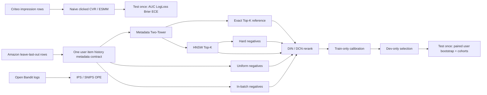

# End-to-End Recommendation Protocol V3

## Scope and evidence boundary

This protocol turns the existing Amazon retrieval and sequence experiments into
one reproducible offline funnel. It does not connect to KAI Compute production,
migration 0066, payment, settlement, or business data. Amazon review/rating
interactions are an implicit next-item proxy; they are not impressions, clicks,
orders, or online conversion evidence.

The Criteo attribution experiment is a separate advertising task because it has
real impression, click, and conversion labels. Its results must never be joined
with the Amazon funnel or described as downstream outcomes from Amazon users.

## One Amazon protocol



The three source datasets stay separated. The lines above represent executable
protocols, not a claim that an Amazon user flows into a Criteo ad impression or
an Open Bandit action.

```text
provider leave-last-out rows
  -> one frozen user/item vocabulary and metadata catalog
  -> Two-Tower query and item embeddings
  -> exact retrieval reference + HNSW Top-K candidates
  -> negative sampler (hard / in-batch / uniform)
  -> DIN-style and DCN-style rerankers
  -> train-only probability calibration
  -> dev-only model selection
  -> one final paired test evaluation
```

Every stage uses the same encoded user, item, history, target, metadata, split,
and seed contract. The candidate trace preserves the retrieved item IDs, scores,
rank positions, target membership, and reranker outputs needed to reproduce a
metric. Test labels may evaluate a frozen run but may not define features,
cohorts, calibration parameters, or model-selection decisions.

## Required comparisons

- Negative sampling: hard candidates from the frozen retriever versus uniform
  unseen items and in-batch negatives under the same training budget.
- Feature ablation: ID only, metadata only, ID plus title, ID plus category, and
  the full allowed feature set. Missing metadata is represented explicitly.
- Retrieval systems: exact dot-product Top-K is the relevance reference; HNSW
  is measured over a fixed parameter grid for recall, query latency, and index
  bytes. ANN recall is not recommendation relevance recall.
- Evaluation: per-user ranking metrics are paired by user. Confidence intervals
  use deterministic user-level bootstrap resampling, never row-level resampling.
- Cold start: user history-length and item train-popularity cohorts are defined
  from training data only and reported with their support.

## Selection and test gate

1. Freeze source-file hashes, config hash, split digest, seeds, vocabulary, and
   candidate protocol.
2. Train candidates and calibration only on training data.
3. Select one configuration from development metrics and record the decision.
4. Run final test once for that frozen selection.
5. Persist raw per-user metric contributions or a deterministic anonymous trace
   so paired intervals and failure analysis can be reproduced.

If the gate is violated, the artifact is invalid and must not be scored.

## Failure analysis checklist

- Target absent from HNSW Top-K: retrieval failure; reranking cannot recover it.
- Target present but loses after reranking: ranking failure; inspect hard
  negatives and metadata coverage.
- Exact retrieval succeeds but HNSW misses: ANN approximation failure; inspect
  `ef_search`, graph connectivity, and cohort skew.
- Calibration improves ECE but damages ranking: expected; calibration and
  ordering objectives must be reported separately.
- Metric gain without paired confidence interval: inconclusive, not a win.
- Cohort improvement with tiny support: report support and avoid generalizing.
- Metadata ablation changes catalog coverage: invalid comparison until coverage
  is held constant or missingness is modeled explicitly.

## CVR / ESMM validity contract

The eligible Criteo Attribution dataset contains one row per impression with
click and conversion labels. The experiment keeps a single impression
population across naive post-click CVR and ESMM. The naive baseline trains only
on clicked impressions but is evaluated with an explicitly stated estimand;
ESMM jointly learns CTR and CTCVR on all impressions. Conversion probability is
derived without substituting clicked-only synthetic data.

The report must include source URL and terms, archive/file hashes, exact row and
label counts, deterministic source-order or time split, train-only preprocessing,
seeds, ROC-AUC, PR-AUC, LogLoss, Brier score, ECE, and limitations. A synthetic
smoke result can validate code paths but cannot replace this report.
